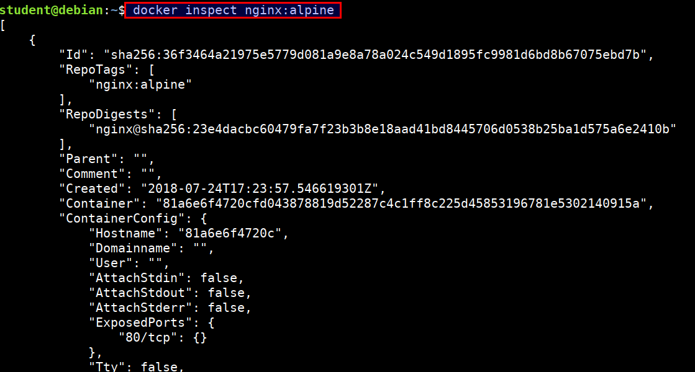
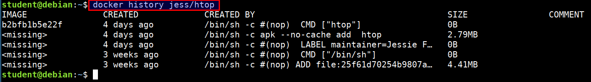

# Docker Management

There are different commands which will be very handy while using and managing docker containers.

## Inspecting container or image

* Returns low-level information on Docker objects

```bash
docker inspect <container name>
docker inspect <image name>
```

* Let's inspect the `nginx:alpine` image

```bash
docker inspect nginx:alpine
```



## Docker history

* Show the history of an image

```
docker history jess/htop
```



## Stopping and removing container

* Let's run an `nginx` container

```bash
docker run --name dummynginx -d nginx:alpine
```

* To remove a container, it has to be stopped. Stop the running container by container name or id

```bash
docker stop dummynginx
```

* If you do not remember container name or id, run following command

```bash
docker ps -a
```

* Once stopped, run the below command

```bash
docker rm dummynginx
```


