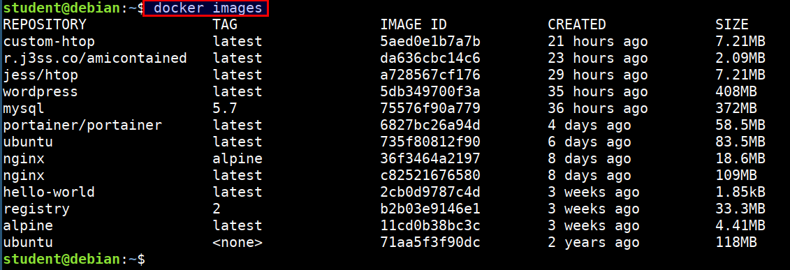
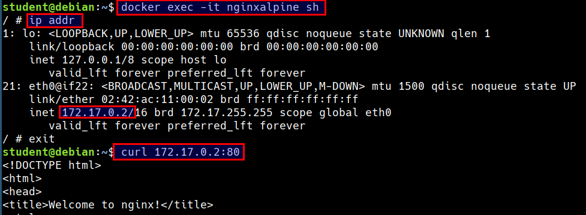

# Docker run

### Running docker container

* Run the following command to start an Ubuntu container

```bash
docker run ubuntu:latest echo "Welcome to Ubuntu"
```


* Run the following command to start an Ubuntu container with interactive bash shell

```bash
docker run --name samplecontainer -it ubuntu:latest /bin/bash
```


### Find your containers

* Listing running containers

```bash
docker ps
```


* Listing all containers (runing/stopped)

```bash
docker ps -a
```


### Listing docker images

```bash
docker images
```




### Running container in detached Mode

* Run an alpine container in the background

```bash
docker run --name pingcontainer -d alpine:latest ping 127.0.0.1 -c 50
```

* Looking at the logs (stdout) of a container

```
docker logs -f pingcontainer
```


### Running nginx container and access the service

```bash
docker run -d --name nginxalpine -p 7777:80 nginx:alpine
```

* Accessing the container service from the host system using mapped port

```bash
curl localhost:7777
```


* Accessing the container service using the container IP and container port

```bash
docker exec -it nginxalpine sh

ip addr

curl 172.17.0.2:80
```

