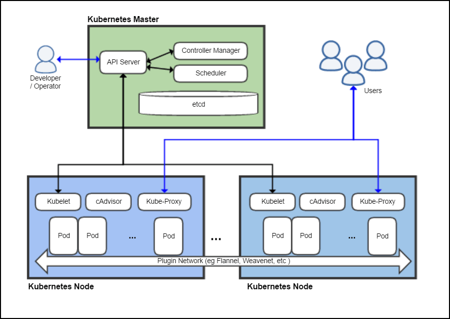

# Kubernetes Overview

Image source: Khtan66 [CC BY-SA 4.0](https://creativecommons.org/licenses/by-sa/4.0"), [from Wikimedia Commons](https://commons.wikimedia.org/wiki/File:Kubernetes.png)

- To work with Kubernetes, you use Kubernetes API objects to describe your cluster’s desired state
- You set your desired state by creating objects using the Kubernetes API, typically via the command-line interface, `kubectl`
- You can also use the Kubernetes API directly to interact with the cluster and set or modify your desired state
- Kubernetes Control Plane works to make the cluster’s current state match the desired state
- Kubernetes performs a variety of tasks automatically
  - such as starting or restarting containers
  - scaling the number of replicas of a given application
  - and a lot more

## Kubernetes Master

The Kubernetes Master is a collection of three processes that run on a single node in your cluster, which is designated as the master node. Those processes are

- [kube-apiserver](https://kubernetes.io/docs/admin/kube-apiserver/)
- [kube-controller-manager](https://kubernetes.io/docs/admin/kube-controller-manager/)
- [kube-scheduler](https://kubernetes.io/docs/admin/kube-scheduler/)

## Kubernetes Node

Each individual non-master node in your cluster runs two processes:

- [kubelet](https://kubernetes.io/docs/admin/kubelet/), which communicates with the Kubernetes Master
- [kube-proxy](https://kubernetes.io/docs/admin/kube-proxy/), a network proxy which reflects Kubernetes networking services on each node

## Kubernetes Objects

Kubernetes contains a number of abstractions that represent the state of your system. These abstractions are represented by objects in the Kubernetes API; see the [Kubernetes Objects overview](https://kubernetes.io/docs/concepts/abstractions/overview/) for more details.

### Basic Objects

The basic Kubernetes objects include:

- [Pod](https://kubernetes.io/docs/concepts/workloads/pods/pod-overview/)
- [Service](https://kubernetes.io/docs/concepts/services-networking/service/)
- [Volume](https://kubernetes.io/docs/concepts/storage/volumes/)
- [Namespace](https://kubernetes.io/docs/concepts/overview/working-with-objects/namespaces/)

### Higher Level Abstractions

In addition, Kubernetes contains a number of higher-level abstractions called Controllers. Controllers build upon the basic objects, and provide additional functionality and convenience features. They include

- [ReplicaSet](https://kubernetes.io/docs/concepts/workloads/controllers/replicaset/)
- [Deployment](https://kubernetes.io/docs/concepts/workloads/controllers/deployment/)
- [StatefulSet](https://kubernetes.io/docs/concepts/workloads/controllers/statefulset/)
- [DaemonSet](https://kubernetes.io/docs/concepts/workloads/controllers/daemonset/)
- [Job](https://kubernetes.io/docs/concepts/workloads/controllers/jobs-run-to-completion/)
